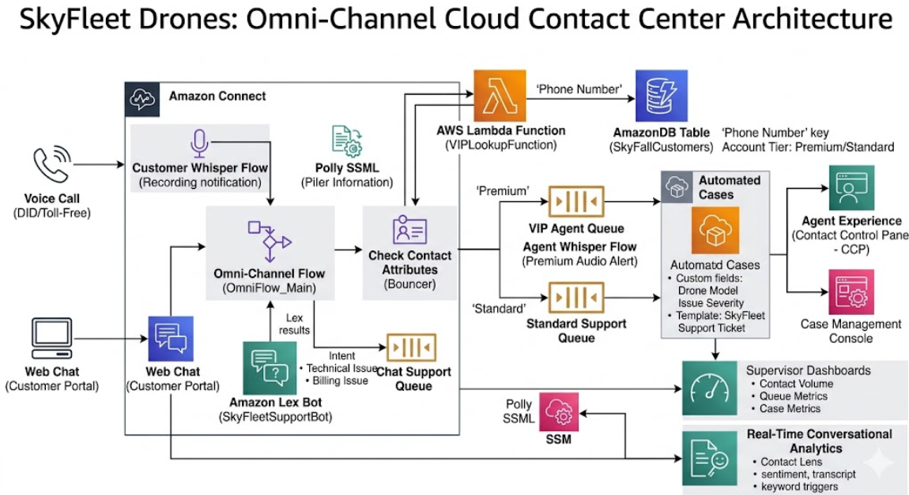

# SkyFleet Drones: Cloud-Native Contact Center Architecture

## Overview
SkyFleet Drones is a fast-growing provider of autonomous drone rentals for hospitals, construction companies, agricultural businesses, and emergency response teams. This repository contains the architecture and backend logic for a modern, cloud-native contact center built on **Amazon Web Services (AWS)** to solve SkyFleet's legacy customer support bottlenecks. 

By migrating to an intelligent, omnichannel architecture, the system now features automated VIP identification, conversational AI routing, and zero-touch support ticket generation.

## Core Features & Architecture

* **Omnichannel Support (Voice & Web Chat):** Unified routing flows handling both DTMF/Voice inputs and Web Chat interactions seamlessly within the same Amazon Connect instance.
* **Dynamic VIP Routing (AWS Lambda & DynamoDB):** Replaces manual account lookups with an event-driven architecture. The `LambdaFunctionForPremium.py` script automatically captures the inbound caller's phone number, queries the `SkyFallCustomers` DynamoDB table, and instantly routes high-tier clients to a dedicated VIP queue with custom agent whisper alerts.
* **Conversational AI (Amazon Lex):** Web chat interactions bypass traditional menus by utilizing Amazon Lex natural language processing to detect intents like *TechnicalIssue* or *BillingIssue*.
* **Automated Case Management (Amazon Cases):** Automatically generates a custom `SkyFleet Support Ticket` (tracking Drone Model and Issue Severity) in the background before the agent connects.
* **Real-Time Analytics (Contact Lens):** Full conversational recording and transcription equipped with keyword detection (e.g., "Drone failed") and real-time supervisor dashboards for queue and case metrics.

## Engineering Challenges & Solutions
**Bypassing Native UI Validation for Automated Tickets:**
During the implementation of the automated Amazon Cases block, native Amazon Connect UI validation constraints blocked the deployment of the background ticket generation. To solve this, the team engineered a workaround by switching to dynamic variables and decoupling the SIP call leg, successfully bypassing the UI blockers and forcing the deployment through for seamless background ticket creation.

## Repository Contents
* `ProjectArchitecture.png`: High-level system architecture diagram illustrating the interaction between Amazon Connect, Lambda, DynamoDB, and Lex.
* `LambdaFunctionForPremium.py`: The custom Python script used to perform real-time caller tier lookups against the DynamoDB database.

## Technologies Used
* **AWS Services:** Amazon Connect, AWS Lambda, Amazon DynamoDB, Amazon Lex, Amazon Polly, Contact Lens
* **Languages:** Python (3.11+)
* **Methodologies:** Agile/Scrum, Event-Driven Architecture, Omnichannel Routing

## Team & Agile Methodology
This architecture was designed and deployed by a 3-person engineering pod operating under Agile methodologies. To prevent deployment blockers and AWS permission conflicts, we divided the architecture into three distinct ownership domains:

* **Backend & AI Logic (My Focus):** Owned the serverless AWS Lambda logic, DynamoDB database design, and Amazon Lex intent integration.
* **CX & Routing Architecture:** Owned the Amazon Connect visual flow design, DTMF routing, and Poly SSML prompt engineering.
* **Operations & Analytics:** Owned the contact center queue structures, Amazon Cases automated templates, and Contact Lens supervisor dashboards.

We utilized GitHub Projects (Kanban) for sprint tracking and held daily stand-ups to manage integration points between our respective cloud domains.
